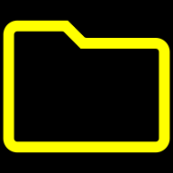

<div align="center">



# 白い熊 書類管理

## 書類管理 is read SHORUI-KANRI — “document management” in Japanese: a file manager built for keeping your documents in order, in private. :@)

**A black-and-yellow, tab-driven file manager — with encrypted gocryptfs volumes built right in.**

A fork of [Material Files](https://github.com/zhanghai/MaterialFiles) with **major additions**:
in-app **gocryptfs** encrypted volumes (no FUSE, no root), **multi-folder tabs**, a full
**black/yellow theme system**, **six listing views** with per-folder styling, a **custom open-with
chooser**, and deep **Termux / share** integration.

Installs **side-by-side** with the official Material Files (app ID `shiroikuma.shoruikanri`).

**📥 Latest release: [`1.7.4+37`](https://github.com/ShiroiKuma0/shiroikuma-shoruikanri/releases/latest)** — [all releases & APK downloads »](https://github.com/ShiroiKuma0/shiroikuma-shoruikanri/releases)

</div>

<!-- README screenshots / videos go here once captured. -->

---

## 🔒 Encrypted gocryptfs volumes, in-app

Open, browse, read and write **gocryptfs** encrypted volumes like any other folder — **no FUSE, no
root**. A JNI-backed file provider over `libgocryptfs` does the crypto in-process. On any cipher
directory a padlock appears next to the address bar: tap it, enter the password, and you’re inside
the decrypted tree; a closing padlock locks the volume again. Your encrypted documents stay encrypted
on disk and never leave the device.

## 🗂 Multi-folder tabs

Keep several folders open at once in a stacked **paper-folder tab bar**. Each tab remembers its own
listing view; **drag** to reorder, **swipe** the file area to flip between tabs, and **long-press** a
tab to pin its folder to your favorites. The whole tab set — paths, selection and per-tab view —
**survives restarts, reboots and app updates**.

## 🎨 Black & yellow, themed to the pixel

A pure-**black** background with pure-**yellow** text, icons and borders, everywhere — lists,
dialogs, menus, toasts, the speed-dial button and the image viewer. A dedicated **UI page** lets you
retune it: per-element **colours** (picker with swatches + hex), **fonts** (import your own
`.ttf`/`.otf`, set family/weight/size), icon size and spacing — all with live previews.

## 🔭 Six listing views + per-folder styling

**List, Grid, Compact, Column, Detailed** and **Wrapped** views. Style the grid to taste — image
size, padding down to zero, a name-over-photo overlay for **seamless photo walls**, or no names at
all — and set **row/column separators** as a clean lattice. Every tweak can be a **global default**
or a **per-folder override** from a sheet on the address line, remembered per path.

## 📂 A smarter Open-with

An in-app open-with chooser that shows every handler with its icon and lets you **remember a default
per file type** — with an “Open as…” escape hatch and a one-tap “forget default”. Remembered
installers even bypass the APK prompt. No more wrestling with the system chooser.

## 📤 Share & Termux, your way

A custom share dialog (pin your favourite apps to the top), an **AutoShare** command entry, and
**one-click Termux script targets** that run a script on the selected file’s real path. It works the
other way too: **share files from any app into 書類管理** and have them piped straight to a Termux
script, with one-tap share tiles.

## 🔤 Power-user touches

- **“Name (literal)” sort** — a per-folder mode that orders digit runs by character instead of
  numeric magnitude, for when you want strict lexicographic order.
- **Paste from the top toolbar** — the pending paste sits top-right where Copy/Cut were, not in a
  bottom bar. **Back keeps your copy armed** (it just navigates the filesystem); long-press the
  paste icon to cancel a pending paste.
- **FOSS & independent** — Firebase Analytics/Crashlytics stripped out, arm64-v8a, signed and
  released on its own, installed alongside the official app.

See [`CHANGELOG.md`](CHANGELOG.md) for the complete, detailed list of everything this fork adds.

---

## Built on Material Files

This project is a fork of [Material Files](https://github.com/zhanghai/MaterialFiles) by Hai Zhang
(installed as `shiroikuma.shoruikanri`, so it coexists with the official build). All upstream work —
the backported NIO2 file layer, Linux-aware file handling (symlinks, permissions, SELinux contexts),
archive support, the FTP/SFTP/SMB/WebDAV clients and the Material Design base — belongs to the
Material Files authors. See the [upstream repository](https://github.com/zhanghai/MaterialFiles) for
issues, contributing and the canonical source. The code remains under the [GNU GPL v3](LICENSE).

## Building

Requires **JDK 17+** and the **Android SDK**. On a machine whose default `java` is older, point
`JAVA_HOME` at a newer JDK:

```
JAVA_HOME=/usr/lib/jvm/java-21-openjdk-amd64 ./gradlew buildApk
```

`buildApk` produces a signed release APK (signing via the gitignored `signing.properties`), copies it
to `~/tmp/`, and bumps the fork build number. See [`CLAUDE.md`](CLAUDE.md) for the full fork workflow —
remotes and branches, versioning, and rebasing onto new upstream releases.
